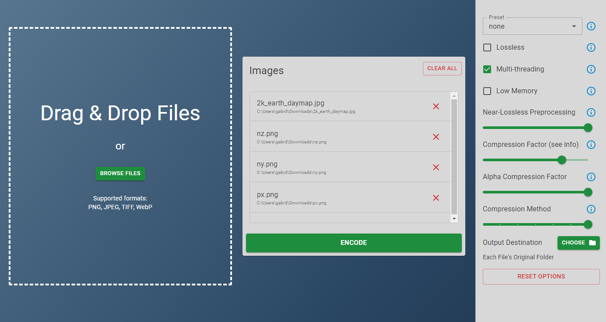

# Bulk Webp Encoder

### Description

This cross-platform app allows users to easily convert and compress various image formats such as PNG, JPG, TIFF, and WebP without paying for a web-based solution or manually scripting out CLI commands. It is built on top of Google's [cwebp](https://developers.google.com/speed/webp/docs/cwebp) CLI tool.

### Features

- **Format Support:** The app supports a wide range of input formats, including PNG, JPG, TIFF, and WebP, enabling users to convert files to WebP efficiently.
- **Multiple File Support:** Users can encode and compress multiple image files simultaneously, streamlining the process for batch conversions.
- **Customizable Output:** Set file outputs to their original directories, or specify a common output directory.
- **Basic Options:** Current functionality includes presets and essential options for compression, allowing users to achieve an optimal balance between image quality, file size, and compression speed.
- **Future Enhancements:** The app is under active development, with plans to introduce performance improvements and additional advanced options for fine-tuning image compression and conversion settings.

### Disclaimer

**Important:** This Electron app is a work in progress and may contain bugs, errors, or unexpected behavior. It has not been extensively tested on all operating systems and hardware configurations.

### Installation

- Download the latest [release](https://github.com/GabeDahl/bulk-webp-encoder/releases) for your OS (Windows support only, for now)
- Unzip the files anywhere
- Run the setup/installation file.
- Start encoding your images!

### Build from Source

- `git clone https://github.com/GabeDahl/bulk-webp-encoder`
- `cd bulk-webp-encoder`
- `npm install`
- `npm run package`

### License

This Electron app is distributed under the MIT License.

### Copyright Notice for cwebp

Copyright (c) 2010, Google Inc. All rights reserved.

THIS SOFTWARE IS PROVIDED BY THE COPYRIGHT HOLDERS AND CONTRIBUTORS "AS IS" AND ANY EXPRESS OR IMPLIED WARRANTIES, INCLUDING, BUT NOT LIMITED TO, THE IMPLIED WARRANTIES OF MERCHANTABILITY AND FITNESS FOR A PARTICULAR PURPOSE ARE DISCLAIMED. IN NO EVENT SHALL THE COPYRIGHT HOLDER OR CONTRIBUTORS BE LIABLE FOR ANY DIRECT, INDIRECT, INCIDENTAL, SPECIAL, EXEMPLARY, OR CONSEQUENTIAL DAMAGES (INCLUDING, BUT NOT LIMITED TO, PROCUREMENT OF SUBSTITUTE GOODS OR SERVICES; LOSS OF USE, DATA, OR PROFITS; OR BUSINESS INTERRUPTION) HOWEVER CAUSED AND ON ANY THEORY OF LIABILITY, WHETHER IN CONTRACT, STRICT LIABILITY, OR TORT (INCLUDING NEGLIGENCE OR OTHERWISE) ARISING IN ANY WAY OUT OF THE USE OF THIS SOFTWARE, EVEN IF ADVISED OF THE POSSIBILITY OF SUCH DAMAGE.
